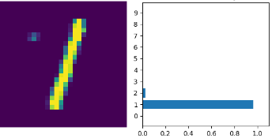
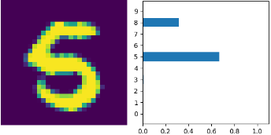
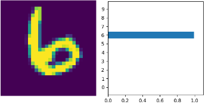
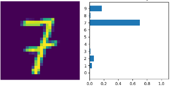
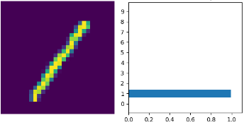
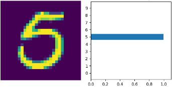
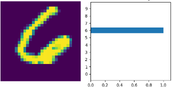
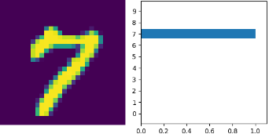

# NeuralNetwork_MNIST_DIGITS
Neural Network to predict handwritten digits from MNIST digit dataset

## Digit Examples (learning_rate=0.005, epochs=3)

   

## Digit Examples (learning_rate=0.1, epochs=10)

   

# NeuralNetwork_MNIST_FASHION
Neural Network to predict clothing from MNIST fashion dataset

2 Convolutional Layers followed by 3 fully connected layers

## Fashion Examples (learning_rate=0.005, epochs=10, optimizer=Adam)
random sample of predictions

green == correct prediction // red == wrong prediction

